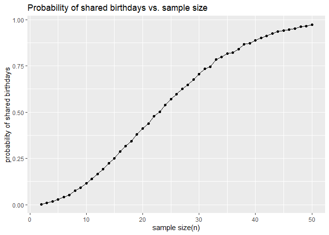

p8105_hw5_zw2975
================
Zhiyu Wei
2024-11-14

## Problem 1

``` r
# normally distributed birthdays function
bd_function = function(x, n_days = 365) {
birthdays = sample (1:n_days, x, replace = TRUE)
return(any(duplicated(birthdays)))
}

set.seed(1)# set a seed

# for a sample size of 2 to 50 people
size = 2:50
prob = numeric(length(size)) #create a probability to be filled in

for(i in size) {
  output = replicate(10000, bd_function(i))
  prob[i-1] = mean(output)
}

# plot probabilities
ggplot(data.frame(sizes=size, probability=prob), aes(x = size, y = prob))+
  geom_line()+
  geom_point()+
  labs(
    title = "Probability of shared birthdays vs. sample size",
    x = "sample size(n)",
    y = "probability of shared birthdays"
  )
```

<!-- -->

## Problem 2

``` r
# set fixed design elements
n = 30
s = 5

set.seed(1)  # set seed

# Function to simulate data and run t-test
power_sim = function(mu, n = 30, sigma = 5, num_sim = 5000, alpha = 0.05) {
  results = replicate(num_sim, {
    x = rnorm(n, mean = mu, sd = s)
    t_test = t.test(x, mu = 0)
    broom::tidy(t_test)
  }, simplify = FALSE)
  
  results = bind_rows(results) |>
    mutate(true_mu = mu)
  
  return(results)
}

# Simulate for different values of mu
mu_values = 0
sim_results = bind_rows(lapply(mu_values, power_sim))

mu_values = 1:6
sim_results = bind_rows(lapply(mu_values, power_sim))

# Calculate power and mean estimates for each mu
power_results = sim_results |>
  group_by(true_mu) |>
  summarise(power = mean(p.value < 0.05),  # Proportion of rejections
    avg_estimate = mean(estimate),
    avg_estimate_rejected = mean(estimate[p.value < 0.05]))
```

``` r
ggplot(power_results, aes(x = true_mu, y = power)) +
  geom_line() +
  geom_point() +
  labs(
    title = "Power vs. True Mean",
    x = "True Mean (μ)",
    y = "Power (Proportion of Null Rejections)"
  )
```

<!-- -->
